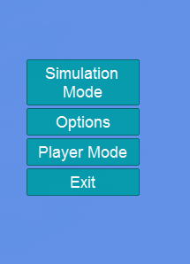
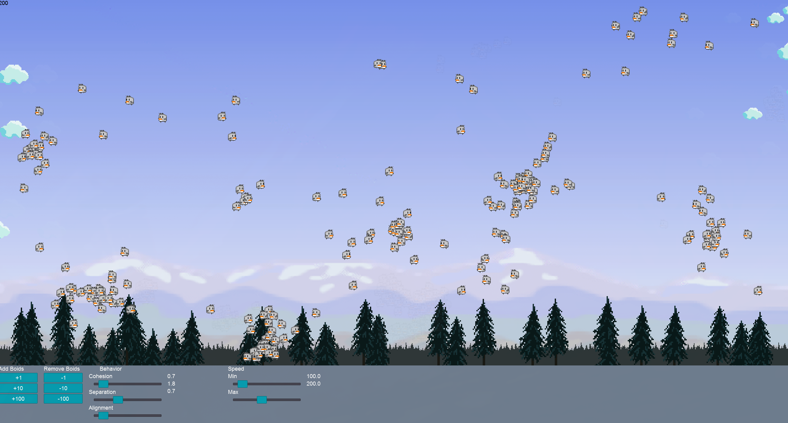
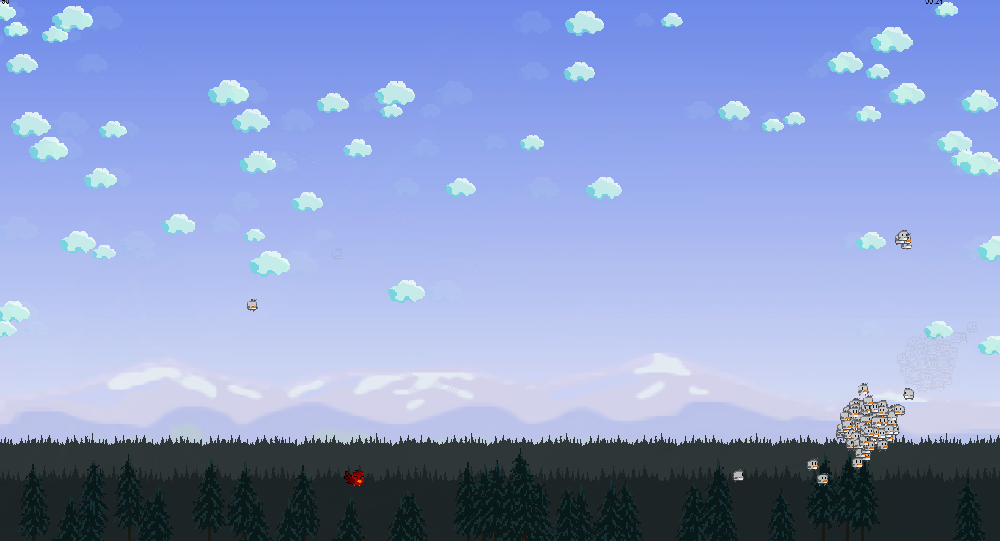

# Boids

A flocking simulation and predator game built with MonoGame.

## About

Boids is a simulation of flocking behavior, inspired by Craig Reynolds' classic boids algorithm. Watch as birds flock together following simple rules of separation, alignment, and cohesion - or take control as a predator and hunt them down!

This project was developed as a learning exercise to get familiar with C# and game development using the MonoGame framework.

## Features

- **Simulation Mode**: Watch the boids flock autonomously with realistic flocking behavior
- **Player Mode**: Control a predator to hunt the boids before time runs out
- **Parallax backgrounds**: Multi-layered scrolling clouds and scenery
- **Customizable settings**: Adjust simulation parameters through the options menu

## Screenshots

The game features a main menu, an autonomous simulation mode, and a player-controlled predator mode.

| Screenshot | Description |
|:----------:|:------------|
|  | *Main menu with game options* |
|  | *Boids flock together following separation, alignment, and cohesion rules* |
|  | *Control the predator and hunt down the boids* |

## Controls

### Player Mode

| Key | Action |
|-----|--------|
| Arrow Keys | Move |
| Left Shift | Sprint |
| Space | Eat boid |
| Escape | Return to menu |

## Built With

- [MonoGame](https://www.monogame.net/) - Open source game framework
- [Gum](https://docs.flatredball.com/gum/) - UI layout engine

## Getting Started

### Prerequisites

- .NET 8.0 SDK

### Running from source

```bash
dotnet restore
dotnet run
```

### Releases

Pre-built releases are available for Windows, Linux, and macOS on the [Releases page](../../releases).

## Future Plans

This project will continue to evolve as long as there's learning value in it. New features and improvements will be added as opportunities arise to explore new concepts in C# and game development.

## Acknowledgments

- Boids algorithm -> Craig Reynolds 
- Backgrounds and sky -> DustDFG, https://opengameart.org/content/pixel-art-mountains-parallax
- Bird Textures -> Mantis,  https://opengameart.org/content/update-animated-birds-character-sheet
- Effects -> Reemax ,https://opengameart.org/content/lpc-items-and-game-effects

## License

This project is licensed under the MIT License - see the [LICENSE](LICENSE) file for details.
